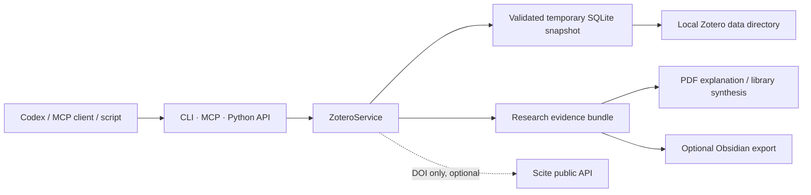

# Zotero Library Reader

[English](README.md) | [简体中文](README.zh-CN.md)

A local-first, read-only Zotero access layer for Codex and other AI clients.
It ships as a Codex skill, zero-dependency CLI, Python API, and MCP server.

## Why this project

This project is deliberately narrower than a full Zotero automation server.
Its niche is turning a private local library into a safe, deterministic
research substrate:

- works whether Zotero is open or closed;
- requires no Zotero account, cloud API key, or local API on port 23119;
- reads a validated temporary SQLite snapshot instead of mutating the live DB;
- exposes metadata, PDF paths, cached full text, notes, and annotations;
- prepares evidence bundles for paper explanation and cross-library synthesis;
- exports an Obsidian-compatible knowledge graph only when requested;
- keeps the normal CLI on the Python standard library.

Only optional Scite enrichment uses the network, sending DOI values but never
PDF contents.

## Feature set

- Personal and group libraries
- Nested collection paths and recursive/direct membership
- Metadata, abstracts, creators, tags, DOI, URL, and citation keys
- Attachment-key resolution to local files
- Zotero `.zotero-ft-cache` full text
- Child notes and PDF annotations grouped by paper
- Metadata search and collection analysis bundles
- Optional Scite tallies and editorial notices
- Optional Obsidian Markdown and `graph.json` export
- Twelve read-only MCP tools

## Architecture



## Requirements and installation

- Python 3.10+
- A local Zotero data directory containing `zotero.sqlite`
- Optional MCP support: `mcp>=1.27,<2`

`C:\Program Files\Zotero` is the application directory, not the data
directory. Typical data locations are `~/Zotero` and
`C:\Users\<name>\Zotero`.

Clone the repository:

```bash
git clone https://github.com/CollinKe05/zotero-library-reader.git
```

Install as a Codex skill on Windows:

```powershell
Copy-Item -Recurse `
  .\zotero-library-reader\zotero-library-reader `
  "$env:USERPROFILE\.codex\skills\zotero-library-reader"
```

On macOS or Linux:

```bash
cp -R ./zotero-library-reader/zotero-library-reader \
  "${CODEX_HOME:-$HOME/.codex}/skills/zotero-library-reader"
```

Open a new Codex task so `$zotero-library-reader` is discovered.

## CLI

The source-tree launcher needs no installation:

```bash
python zotero-library-reader/scripts/zotero_cli.py locate
python zotero-library-reader/scripts/zotero_cli.py collections \
  --library "My Library"
python zotero-library-reader/scripts/zotero_cli.py items \
  --collection "Research/Robotics"
python zotero-library-reader/scripts/zotero_cli.py bundle \
  --collection "Research/Robotics"
python zotero-library-reader/scripts/zotero_cli.py fulltext --key ABCD1234
python zotero-library-reader/scripts/zotero_cli.py digest \
  --collection "Research/Robotics"
python zotero-library-reader/scripts/zotero_cli.py scite \
  --collection "Research/Robotics"
```

Pass `--data-dir "/path/to/Zotero"` before the subcommand if automatic
discovery finds multiple data directories.

For reusable console commands:

```bash
python -m pip install -e ./zotero-library-reader
zotero-local locate
```

## MCP

```bash
python -m pip install -e "./zotero-library-reader[mcp]"
zotero-local-mcp
```

Generic MCP configuration:

```json
{
  "mcpServers": {
    "zotero-local": {
      "command": "python",
      "args": ["/absolute/path/zotero-library-reader/scripts/zotero_mcp.py"],
      "env": {
        "ZOTERO_DATA_DIR": "/absolute/path/to/Zotero"
      }
    }
  }
}
```

Tools:

- `zotero_locate_data_dirs`
- `zotero_list_libraries`
- `zotero_list_collections`
- `zotero_list_items`
- `zotero_get_collection_bundle`
- `zotero_get_item`
- `zotero_resolve_attachment`
- `zotero_search`
- `zotero_get_cached_fulltext`
- `zotero_get_annotation_digest`
- `zotero_scite_item`
- `zotero_scite_collection`

The MCP surface remains read-only. The last two tools are networked and
optional.

## Paper and library analysis

The access layer deliberately stops at reliable evidence preparation. An AI
client can use the resulting metadata, cached text, user highlights, notes,
and PDFs to compare papers by problem, embodiment, representation, policy
architecture, training data, evaluation, limitations, chronology, and open
research gaps.

Collection membership is never treated as proof of citation or influence.

Optional Obsidian export:

```bash
python zotero-library-reader/scripts/zotero_cli.py obsidian \
  --collection "Research/Robotics" \
  --output-dir "./obsidian-export"
```

## Position relative to other projects

| Project | Best fit | Trade-off |
|---|---|---|
| This project | Local-first Codex research workflows, safe snapshots, evidence bundles, optional Obsidian | Intentionally read-only; no built-in vector DB |
| [54yyyu/zotero-mcp](https://github.com/54yyyu/zotero-mcp) | Broad MCP, semantic search, Zotero API and write workflows | Larger dependency and operational surface |
| [scitedotai/scite-zotero-plugin](https://github.com/scitedotai/scite-zotero-plugin) | Scite columns directly inside Zotero | Desktop UI plugin, not a general research MCP; no repository license detected |
| [MuiseDestiny/zotero-gpt](https://github.com/MuiseDestiny/zotero-gpt) | Chat and commands directly inside Zotero | AGPL desktop plugin and model-configuration surface |

These projects are complements. For example, use `zotero-mcp` separately when
you need vector semantic search or writes, and use this project when you need a
minimal, auditable local research access layer.

## Python API

```python
from zotero_local_reader import ZoteroService

zotero = ZoteroService("/path/to/Zotero")
bundle = zotero.collection_bundle("Research/Robotics")
digest = zotero.annotation_digest("Research/Robotics")
fulltext = zotero.cached_fulltext("ABCD1234")
```

## Privacy

- The live database is never modified.
- Temporary snapshots are validated and deleted after each operation.
- Local metadata, paths, notes, and PDF text may be private.
- Scite calls transmit DOI values only and are never automatic.
- PDF content is not uploaded by this project.

## License

[MIT](LICENSE)
