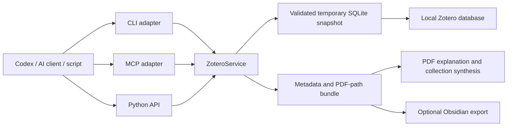

# Zotero Library Reader

[English](README.md) | [简体中文](README.zh-CN.md)

A portable, read-only Codex skill, Python API, CLI, and MCP server for local Zotero libraries.

It can locate Zotero data directories, browse personal and group libraries, resolve collection paths, search metadata, map attachment keys to local PDFs, prepare collections for AI-assisted paper analysis, and export an optional Obsidian-compatible metadata network.

## Highlights

- Read personal and group libraries from local `zotero.sqlite`
- Browse nested collections by full path
- Extract titles, abstracts, authors, tags, DOI, URLs, citation keys, and attachments
- Resolve Zotero storage keys such as `ABCD1234`
- Build full collection bundles for PDF explanation and cross-paper synthesis
- Export Obsidian Markdown notes, index pages, and `graph.json` on request
- Expose eight read-only MCP tools
- Keep the live Zotero database untouched through validated temporary snapshots
- Run the CLI with only the Python standard library

## Architecture



## Requirements

- Python 3.10 or newer
- A local Zotero data directory containing `zotero.sqlite`
- Optional MCP support: `mcp>=1.27,<2`

The Zotero application directory, such as `C:\Program Files\Zotero`, is not the data directory. Common data locations include `~/Zotero` and `C:\Users\<name>\Zotero`.

## Install as a Codex skill

Clone the repository:

```bash
git clone https://github.com/CollinKe05/zotero-library-reader.git
```

Windows PowerShell:

```powershell
Copy-Item -Recurse `
  .\zotero-library-reader\zotero-library-reader `
  "$env:USERPROFILE\.codex\skills\zotero-library-reader"
```

macOS or Linux:

```bash
cp -R ./zotero-library-reader/zotero-library-reader \
  "${CODEX_HOME:-$HOME/.codex}/skills/zotero-library-reader"
```

Restart or open a new Codex task so the skill can be discovered as `$zotero-library-reader`.

## CLI

The source-tree launcher requires no installation:

```bash
python zotero-library-reader/scripts/zotero_cli.py locate
python zotero-library-reader/scripts/zotero_cli.py libraries
python zotero-library-reader/scripts/zotero_cli.py collections --library "My Library"
python zotero-library-reader/scripts/zotero_cli.py items \
  --library "My Library" \
  --collection "Research/Robotics"
python zotero-library-reader/scripts/zotero_cli.py attachment --key ABCD1234
```

Specify a data directory when automatic discovery finds more than one:

```bash
python zotero-library-reader/scripts/zotero_cli.py \
  --data-dir "/path/to/Zotero" \
  items --collection "Collection/Subcollection"
```

Install the reusable Python package and console commands:

```bash
python -m pip install -e ./zotero-library-reader
zotero-local locate
```

## MCP server

Install the optional official MCP SDK dependency:

```bash
python -m pip install -e "./zotero-library-reader[mcp]"
```

Start the stdio server:

```bash
zotero-local-mcp
```

Generic MCP client configuration:

```json
{
  "mcpServers": {
    "zotero-local": {
      "command": "python",
      "args": ["/absolute/path/zotero-library-reader/scripts/zotero_mcp.py"],
      "env": {
        "ZOTERO_DATA_DIR": "/absolute/path/to/Zotero"
      }
    }
  }
}
```

Available tools:

- `zotero_locate_data_dirs`
- `zotero_list_libraries`
- `zotero_list_collections`
- `zotero_list_items`
- `zotero_get_collection_bundle`
- `zotero_get_item`
- `zotero_resolve_attachment`
- `zotero_search`

The MCP interface is intentionally read-only.

## Paper explanation and library synthesis

The access layer returns full metadata, abstracts, tags, and resolved attachment paths:

```bash
python zotero-library-reader/scripts/zotero_cli.py bundle \
  --collection "Research/Robotics"
```

An AI client can then read selected PDFs and connect papers by:

- research problem and chronology
- embodiment, observation, and action spaces
- architecture and action-generation method
- training data and supervision
- evaluation setting and generalization
- limitations, lineage, and open research gaps

Collection membership alone is not treated as evidence of citation or influence.

## Optional Obsidian network

Run this only when an export is wanted:

```bash
python zotero-library-reader/scripts/zotero_cli.py obsidian \
  --collection "Research/Robotics" \
  --output-dir "./obsidian-export"
```

The exporter creates:

- one Markdown note per paper
- collection and creator notes
- `00-Index.md`
- `graph.json`

Optional semantic paper-to-paper relationships can be supplied with `--relations relations.json`. These relations should be created only after evidence-grounded PDF analysis.

## Python API

```python
from zotero_local_reader import ZoteroService

zotero = ZoteroService("/path/to/Zotero")
collections = zotero.collections("My Library")
bundle = zotero.collection_bundle(
    collection="Research/Robotics",
    library="My Library",
)
```

## Repository layout

```text
.
├── README.md
├── README.zh-CN.md
├── LICENSE
└── zotero-library-reader/
    ├── SKILL.md
    ├── agents/
    ├── references/
    ├── scripts/
    ├── src/zotero_local_reader/
    └── pyproject.toml
```

## Privacy and safety

- No Zotero credentials, cloud API keys, or network access are required.
- The live database is never modified.
- Temporary snapshots are validated and deleted after each command.
- Attachment paths and bibliographic metadata may be private; expose an HTTP MCP server only on trusted interfaces.
- PDF content is not uploaded or analyzed unless the calling client explicitly performs that step.

## License

[MIT](LICENSE)
