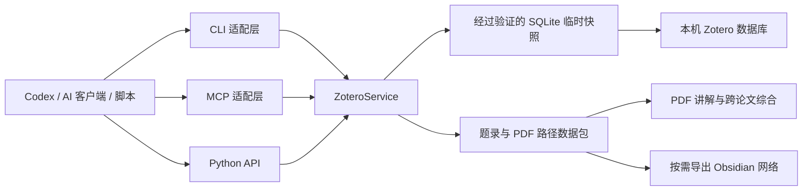

# Zotero Library Reader

[English](README.md) | [简体中文](README.zh-CN.md)

一个可移植、只读的本机 Zotero 访问工程，同时提供 Codex 技能、Python API、CLI 和 MCP 服务。

它能够定位 Zotero 数据目录、浏览个人及群组文库、解析多级分类、搜索题录、将附件键映射到本地 PDF、为 AI 论文讲解和跨文献综合准备数据，并可按需导出兼容 Obsidian 的文献网络。

## 主要能力

- 从本机 `zotero.sqlite` 读取个人文库和群组文库
- 按完整路径访问多级分类
- 获取标题、摘要、作者、标签、DOI、网址、引用键和附件
- 解析 `ABCD1234` 一类 Zotero 存储附件键
- 为单篇 PDF 讲解和整库综合生成完整数据包
- 按需导出 Obsidian Markdown、索引和 `graph.json`
- 提供 8 个只读 MCP 工具
- 通过经过验证的临时快照保护 Zotero 原数据库
- CLI 仅依赖 Python 标准库

## 架构



## 环境要求

- Python 3.10 或更高版本
- 本机存在包含 `zotero.sqlite` 的 Zotero 数据目录
- MCP 为可选能力，依赖 `mcp>=1.27,<2`

`C:\Program Files\Zotero` 一类路径是程序目录，不是数据目录。常见数据目录为 `~/Zotero` 或 `C:\Users\<用户名>\Zotero`。

## 安装为 Codex 技能

克隆仓库：

```bash
git clone https://github.com/CollinKe05/zotero-library-reader.git
```

Windows PowerShell：

```powershell
Copy-Item -Recurse `
  .\zotero-library-reader\zotero-library-reader `
  "$env:USERPROFILE\.codex\skills\zotero-library-reader"
```

macOS 或 Linux：

```bash
cp -R ./zotero-library-reader/zotero-library-reader \
  "${CODEX_HOME:-$HOME/.codex}/skills/zotero-library-reader"
```

重新启动 Codex 或新建任务，即可通过 `$zotero-library-reader` 发现该技能。

## CLI 使用

直接运行源码启动器，无需安装：

```bash
python zotero-library-reader/scripts/zotero_cli.py locate
python zotero-library-reader/scripts/zotero_cli.py libraries
python zotero-library-reader/scripts/zotero_cli.py collections --library "我的文库"
python zotero-library-reader/scripts/zotero_cli.py items \
  --library "我的文库" \
  --collection "研究资料/机器人"
python zotero-library-reader/scripts/zotero_cli.py attachment --key ABCD1234
```

如果自动发现了多个数据目录，请显式指定：

```bash
python zotero-library-reader/scripts/zotero_cli.py \
  --data-dir "C:\Users\<用户名>\Zotero" \
  items --collection "分类/子分类"
```

也可以安装 Python 包和命令行入口：

```bash
python -m pip install -e ./zotero-library-reader
zotero-local locate
```

## MCP 服务

安装官方 MCP SDK 可选依赖：

```bash
python -m pip install -e "./zotero-library-reader[mcp]"
```

启动 stdio 服务：

```bash
zotero-local-mcp
```

通用 MCP 客户端配置：

```json
{
  "mcpServers": {
    "zotero-local": {
      "command": "python",
      "args": ["<技能绝对路径>/scripts/zotero_mcp.py"],
      "env": {
        "ZOTERO_DATA_DIR": "C:\\Users\\<用户名>\\Zotero"
      }
    }
  }
}
```

提供以下工具：

- `zotero_locate_data_dirs`
- `zotero_list_libraries`
- `zotero_list_collections`
- `zotero_list_items`
- `zotero_get_collection_bundle`
- `zotero_get_item`
- `zotero_resolve_attachment`
- `zotero_search`

MCP 接口有意保持为只读，不提供修改 Zotero 数据库的工具。

## 论文讲解和整库综合

先获取完整题录、摘要、标签和 PDF 路径：

```bash
python zotero-library-reader/scripts/zotero_cli.py bundle \
  --collection "研究资料/机器人"
```

AI 客户端随后可以读取选定 PDF，并沿以下维度串联论文：

- 研究问题和时间脉络
- 具身形态、观测空间与动作空间
- 模型架构和动作生成方法
- 训练数据与监督方式
- 评测场景和泛化能力
- 局限、技术继承关系和开放问题

分类归属本身不会被当作论文引用或影响关系的证据。

## 按需导出 Obsidian 网络

仅在明确需要导出时执行：

```bash
python zotero-library-reader/scripts/zotero_cli.py obsidian \
  --collection "研究资料/机器人" \
  --output-dir "./obsidian-export"
```

导出结果包括：

- 每篇论文一个 Markdown 笔记
- 分类和作者节点
- `00-Index.md`
- `graph.json`

还可以通过 `--relations relations.json` 加入论文之间的语义关系。此类关系应在实际阅读 PDF 并获得证据后生成。

## Python API

```python
from zotero_local_reader import ZoteroService

zotero = ZoteroService(r"C:\Users\<用户名>\Zotero")
collections = zotero.collections("我的文库")
bundle = zotero.collection_bundle(
    collection="研究资料/机器人",
    library="我的文库",
)
```

## 仓库结构

```text
.
├── README.md
├── README.zh-CN.md
├── LICENSE
└── zotero-library-reader/
    ├── SKILL.md
    ├── agents/
    ├── references/
    ├── scripts/
    ├── src/zotero_local_reader/
    └── pyproject.toml
```

## 隐私与安全

- 不需要 Zotero 账号密码、云端 API 密钥或网络访问。
- 不会修改正在使用的 Zotero 原数据库。
- 每次命令创建经过验证的临时快照，并在结束后删除。
- 附件路径和题录可能包含隐私信息；若启用 HTTP MCP，只应绑定可信网络接口。
- 除非调用方明确执行，否则不会上传或分析 PDF 内容。

## 许可证

[MIT](LICENSE)
