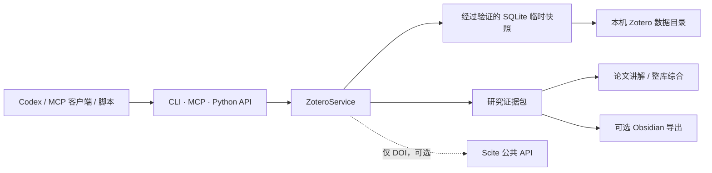

# Zotero Library Reader

[English](README.md) | [简体中文](README.zh-CN.md)

一个面向 Codex 和其他 AI 客户端的“本地优先、只读”Zotero 访问层，同时提供
Codex Skill、零依赖 CLI、Python API 与 MCP 服务。

## 为什么需要这个项目

本项目不追求成为功能最全的 Zotero 自动化服务器。它的生态位是：把私有的本地
文献库安全、稳定地转换为 AI 可使用的研究基础设施。

- Zotero 打开或关闭时都能工作；
- 不需要 Zotero 账号、云端 API Key，也不依赖 23119 本地 API；
- 通过经过验证的 SQLite 临时快照读取，不修改正在使用的数据库；
- 获取题录、PDF 路径、缓存全文、笔记和 PDF 批注；
- 为单篇讲解、跨论文比较和整库分析生成证据包；
- 仅在用户要求时导出兼容 Obsidian 的知识网络；
- 常规 CLI 只使用 Python 标准库。

只有可选的 Scite 增强需要联网；它仅发送 DOI，不发送 PDF 内容。

## 功能

- 个人文库与群组文库
- 多级分类路径、递归或仅直属条目
- 标题、摘要、作者、标签、DOI、URL、引用键
- 将 Zotero 附件键解析为本机文件
- 读取 Zotero `.zotero-ft-cache` 缓存全文
- 按论文汇总子笔记和 PDF 批注
- 题录搜索与整分类分析数据包
- 可选 Scite 引用语境计数与编辑声明
- 可选 Obsidian Markdown 与 `graph.json`
- 12 个只读 MCP 工具

## 架构



## 环境与安装

- Python 3.10+
- 本机存在包含 `zotero.sqlite` 的 Zotero 数据目录
- MCP 为可选依赖：`mcp>=1.27,<2`

`C:\Program Files\Zotero` 是程序目录，不是数据目录。常见数据目录为
`~/Zotero` 或 `C:\Users\<用户名>\Zotero`。

克隆仓库：

```bash
git clone https://github.com/CollinKe05/zotero-library-reader.git
```

在 Windows 上安装为 Codex Skill：

```powershell
Copy-Item -Recurse `
  .\zotero-library-reader\zotero-library-reader `
  "$env:USERPROFILE\.codex\skills\zotero-library-reader"
```

macOS 或 Linux：

```bash
cp -R ./zotero-library-reader/zotero-library-reader \
  "${CODEX_HOME:-$HOME/.codex}/skills/zotero-library-reader"
```

新建一个 Codex 任务后，即可发现 `$zotero-library-reader`。

## CLI

直接运行源码启动器，无需安装：

```bash
python zotero-library-reader/scripts/zotero_cli.py locate
python zotero-library-reader/scripts/zotero_cli.py collections \
  --library "My Library"
python zotero-library-reader/scripts/zotero_cli.py items \
  --collection "Research/Robotics"
python zotero-library-reader/scripts/zotero_cli.py bundle \
  --collection "Research/Robotics"
python zotero-library-reader/scripts/zotero_cli.py fulltext --key ABCD1234
python zotero-library-reader/scripts/zotero_cli.py digest \
  --collection "Research/Robotics"
python zotero-library-reader/scripts/zotero_cli.py scite \
  --collection "Research/Robotics"
```

如果自动发现多个数据目录，请在子命令前增加
`--data-dir "C:\Users\<用户名>\Zotero"`。

安装为 Python 包和命令行程序：

```bash
python -m pip install -e ./zotero-library-reader
zotero-local locate
```

## MCP

```bash
python -m pip install -e "./zotero-library-reader[mcp]"
zotero-local-mcp
```

通用 MCP 客户端配置：

```json
{
  "mcpServers": {
    "zotero-local": {
      "command": "python",
      "args": ["<Skill 绝对路径>/scripts/zotero_mcp.py"],
      "env": {
        "ZOTERO_DATA_DIR": "C:\\Users\\<用户名>\\Zotero"
      }
    }
  }
}
```

工具列表：

- `zotero_locate_data_dirs`
- `zotero_list_libraries`
- `zotero_list_collections`
- `zotero_list_items`
- `zotero_get_collection_bundle`
- `zotero_get_item`
- `zotero_resolve_attachment`
- `zotero_search`
- `zotero_get_cached_fulltext`
- `zotero_get_annotation_digest`
- `zotero_scite_item`
- `zotero_scite_collection`

MCP 始终只读。最后两个工具需要联网，但完全可选。

## 论文讲解与整库分析

访问层负责提供可靠证据，而不是把分析逻辑锁死在某个模型中。AI 客户端可以结合
题录、缓存全文、用户高亮、笔记和 PDF，沿研究问题、具身形态、表征、策略架构、
训练数据、评测、局限、时间脉络和开放问题等维度串联论文。

分类归属本身不会被当作引用或技术影响关系的证据。

按需导出 Obsidian 网络：

```bash
python zotero-library-reader/scripts/zotero_cli.py obsidian \
  --collection "Research/Robotics" \
  --output-dir "./obsidian-export"
```

## 与其他项目的定位

| 项目 | 最适合 | 取舍 |
|---|---|---|
| 本项目 | 本地优先的 Codex 研究工作流、安全快照、证据包、可选 Obsidian | 刻意只读，不内置向量数据库 |
| [54yyyu/zotero-mcp](https://github.com/54yyyu/zotero-mcp) | 大而全 MCP、语义搜索、Zotero API 与写入流程 | 依赖和运行复杂度更高 |
| [scitedotai/scite-zotero-plugin](https://github.com/scitedotai/scite-zotero-plugin) | 直接在 Zotero 中显示 Scite 列 | 是桌面插件而非研究 MCP；仓库未检测到许可证 |
| [MuiseDestiny/zotero-gpt](https://github.com/MuiseDestiny/zotero-gpt) | 直接在 Zotero 内聊天和执行命令 | AGPL 桌面插件，模型配置与安全面更大 |

它们更适合组合而不是互相替代。例如，需要向量语义搜索或写操作时单独使用
`zotero-mcp`；需要最小化、可审计的本地研究访问层时使用本项目。

## Python API

```python
from zotero_local_reader import ZoteroService

zotero = ZoteroService(r"C:\Users\<用户名>\Zotero")
bundle = zotero.collection_bundle("Research/Robotics")
digest = zotero.annotation_digest("Research/Robotics")
fulltext = zotero.cached_fulltext("ABCD1234")
```

## 隐私

- 不修改正在使用的 Zotero 数据库；
- 每次操作都会验证临时快照，并在结束后删除；
- 本机题录、路径、笔记和全文都可能属于隐私数据；
- Scite 调用只发送 DOI，且不会自动执行；
- 本项目不会上传 PDF 内容。

## 许可证

[MIT](LICENSE)
